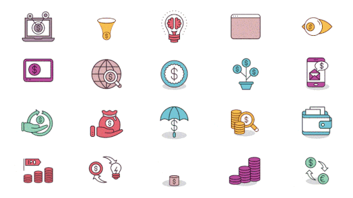

# Personal Finance Tracker

Welcome to the Personal Finance Tracker! This web application allows you to manage your income and expenses effectively, providing you with a clear overview of your financial records. Track your transactions, categorize them, and gain insights into your spending patterns.

## Features

- **Add Transactions:** Easily add new income or expense transactions with a few simple steps.
- **Edit Transactions:** Edit existing transactions inline, updating the type, category, and amount as needed.
- **Delete Transactions:** Remove unwanted transactions from your records, keeping your financial history up-to-date.
- **Pagination:** Navigate through your transactions using the pagination feature for a better user experience.
- **Balance Calculation:** Automatically calculate and update your balance with each transaction, providing you with real-time financial insights.

## Technologies Used

- HTML5, CSS3, and JavaScript: The core languages used for building the front-end of the website.
- DOM Manipulation: Interact with the Document Object Model (DOM) to dynamically update and display transactions.
- Responsive Design: Ensure the website adapts to different screen sizes for optimal user experience.
- Styling: Custom CSS styles have been implemented to create an attractive and intuitive user interface.
-Frameworks: Bootstrap: A popular CSS framework for responsive design and layout.

## Getting Started

To get started with the Personal Finance Tracker, follow these steps:

1. Clone the repository:
git clone https://github.com/vishalbansal28/Personal-Finance-Tracker.git

2. Open the index.html file in your web browser.

3. Start managing your income and expenses by adding, editing, or deleting transactions.

## Future Enhancements

The Personal Finance Tracker can be further enhanced with the following features:

- **Data Persistence:** Implement a backend or database integration to store transactions persistently.
- **User Authentication:** Add user registration and login functionality to secure personal financial data.
- **Filtering and Sorting:** Enable users to filter and sort transactions based on categories, dates, or amounts.
- **Reports and Analytics:** Provide visual representations and insights into spending patterns and financial trends.
- **Budgeting Tools:** Allow users to set budgets, track expenses against budgets, and receive notifications.

## Contributing

Contributions are welcome! If you have any ideas for improvements or bug fixes, feel free to submit a pull request. Please ensure to follow the code style and guidelines of the project.

## License

This project is licensed under the [MIT License](LICENSE).

## Acknowledgements

- The Personal Finance Tracker was developed as part of a personal project.
- Special thanks to Twitter-tech community for assistance.

